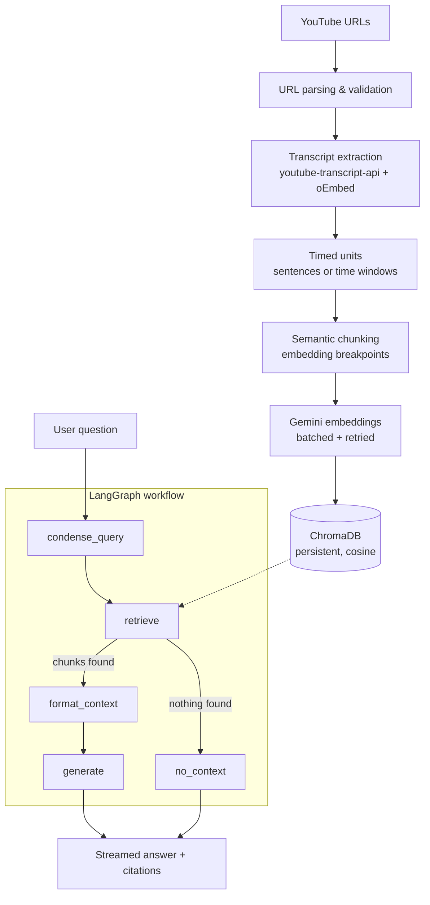

<div align="center">

# ▶ YouTube RAG

**Chat with the knowledge inside any YouTube video.**

Paste one or more YouTube links, and the app extracts the transcripts, splits them
into topic-coherent chunks, embeds them with Gemini, stores them in a persistent
ChromaDB collection, and lets you ask questions — with every answer citing the
exact moment in the video it came from.

[](https://python.org)
[](https://langchain-ai.github.io/langgraph/)
[](https://ai.google.dev/)
[](https://trychroma.com)
[](https://streamlit.io)

</div>

---

## Table of contents

- [Features](#features)
- [Architecture](#architecture)
- [Quick start](#quick-start)
- [Environment setup](#environment-setup)
- [Usage](#usage)
- [Screenshots](#screenshots)
- [Project structure](#project-structure)
- [Configuration reference](#configuration-reference)
- [Technologies](#technologies)
- [Troubleshooting](#troubleshooting)
- [Future improvements](#future-improvements)

---

## Features

### Ingestion
- **Multi-video input** — paste one link or fifty, newline/comma/space separated.
- **Every URL form** — `watch?v=`, `youtu.be/`, `/shorts/`, `/embed/`, `/live/`, `music.youtube.com`, bare video IDs, links with `&t=`/`&list=` parameters.
- **Live validation** — valid/invalid counts update as you type; duplicates are dropped automatically.
- **Parallel fetching** — transcripts are pulled concurrently with per-video progress.
- **Rich metadata** — title, channel and thumbnail resolved via YouTube's oEmbed endpoint (no second API key needed).
- **Graceful degradation** — disabled captions, private/deleted videos, age restriction, region locks and IP blocks each produce a specific, actionable message instead of a stack trace. One bad video never fails the batch.
- **Language fallback** — prefers your configured languages, then any manually written captions, then auto-generated ones, translating when YouTube offers it.

### Intelligent chunking (not fixed-length)
- **Topic-preserving semantic chunking** — sentences are embedded and boundaries are placed where the topic *actually* shifts, measured by cosine distance between consecutive sentences.
- **Timestamp preservation** — every chunk knows its start/end time, so citations deep-link straight to the moment (`youtube.com/watch?v=…&t=852s`).
- **Handles unpunctuated ASR** — YouTube auto-captions contain no full stops at all; the chunker detects this and falls back to time-window units instead of producing one giant sentence.
- **Configurable** — chunk size, overlap, breakpoint percentile and minimum chunk size are all environment-driven.

### Retrieval
- **MMR diversification** — stops the top-k from being five near-identical chunks of the same passage.
- **Relevance scores** — shown as a percentage on every citation.
- **Metadata filtering** — scope a question to specific videos from the sidebar.
- **Context compression** — trims low-signal sentences from long chunks, at zero token cost.
- **Deduplication** — overlapping chunks that surface the same text are collapsed.

### Generation
- **LangGraph workflow** — an explicit, extensible state machine, not a hidden chain.
- **Strict grounding** — answers come only from retrieved context; when nothing relevant is found the model is never even called, so the refusal sentence is exact.
- **Inline citations** — `[1]`, `[2]` markers tied to source cards with clickable timestamps.
- **Conversation memory** — follow-ups like "what about that?" are rewritten into standalone search queries before retrieval.
- **Token streaming** — answers appear word by word.

### Interface
ChatGPT-style chat with streaming, typing indicator, markdown and code-block rendering, copy-answer button, clear chat, source cards, sidebar library with per-video delete, live database statistics, progress bars, toast notifications, status badges and a responsive dark theme.

---

## Architecture



The graph short-circuits when retrieval returns nothing: `generate` is skipped
entirely, which guarantees the exact "not found" sentence and avoids paying for
a generation that could not be grounded.

**Request path for one question**

| Step | Module | What happens |
|------|--------|--------------|
| 1 | `graph.py` → `condense_query` | Follow-up questions rewritten into standalone queries using chat history |
| 2 | `retriever.py` | Over-fetch candidates, MMR-diversify, threshold, dedupe, compress |
| 3 | `prompts.py` | Chunks rendered into a numbered CONTEXT block within a hard character budget |
| 4 | `llm.py` | Gemini streams the answer under strict grounding rules |
| 5 | `ui.py` | Tokens render live; citations become clickable timestamp cards |

---

## Quick start

**Requirements:** Python 3.12+ and a free [Google AI Studio API key](https://aistudio.google.com/apikey).

```bash
# 1. Enter the project
cd youtube_rag

# 2. Create and activate a virtual environment
python3 -m venv .venv
source .venv/bin/activate          # Windows: .venv\Scripts\activate

# 3. Install dependencies
pip install -r requirements.txt

# 4. Add your API key
#    A .env file is already present — open it and paste your key:
#      GOOGLE_API_KEY=your_key_here
#    (or: cp .env.example .env)

# 5. Run
streamlit run app.py
```

The app opens at **http://localhost:8501**.

> **First run downloads nothing extra** — no local embedding model, no GPU, no
> Docker. The vector database is created on demand at `./chroma_db`.

---

## Environment setup

Only one variable is required:

```dotenv
GOOGLE_API_KEY=your_key_here
```

Everything else has a working default. The full annotated list lives in
[`.env.example`](.env.example); see the [configuration reference](#configuration-reference)
below for the knobs worth changing.

> **Security:** `.env` is listed in `.gitignore` and the key is never written to
> logs, the vector store or the UI. Only the last six characters are used, as a
> cache-invalidation key.

---

## Usage

1. **Index videos.** Paste links into the sidebar and press **⚡ Process videos**.
   Progress is shown per video; already-indexed videos are skipped unless you
   tick *Re-index if already present*.
2. **Ask questions.** Once at least one video is indexed the chat box appears.
3. **Follow the citations.** Expand **📎 Sources** under any answer and click a
   timestamp to jump to that exact second on YouTube.

**Questions that work well**

```
Summarise the entire video.
What are the key takeaways?
What is the speaker's opinion on AI?
What were the main topics discussed?
What did the presenter say about LangChain?
Compare what video 1 and video 2 say about agents.
```

If the answer genuinely is not in the indexed transcripts, the app replies:

> I couldn't find this information in the indexed videos.

**Sidebar controls**

| Control | Purpose |
|---------|---------|
| Chat model | Switch between Flash / Pro / Flash-Lite without restarting |
| Retrieved chunks (k) | More context vs. lower latency and token cost |
| Search strategy | `mmr` (diverse) or `similarity` (nearest) |
| Limit search to | Restrict retrieval to chosen videos |
| Remove | Delete one video's vectors |
| Clear database | Wipe the collection (two-step confirm) |

---

## Screenshots

> Place images in [`assets/`](assets/) and they will render here.

| Chat with citations | Sidebar & indexing |
|---|---|
|  |  |

---

## Project structure

```
youtube_rag/
├── app.py                  # Streamlit entry point — session state, sidebar, chat loop
├── .env                    # Your API key (git-ignored)
├── .env.example            # Fully annotated configuration template
├── requirements.txt        # Pinned, verified dependency set
├── README.md               # This file
├── EXPLANATION.md          # How it works, problems solved, scalability design
├── .streamlit/
│   └── config.toml         # Theme and server settings
├── chroma_db/              # Persistent vector store (auto-created, git-ignored)
├── assets/                 # Screenshots
└── src/
    ├── config.py           # Env-driven settings with validation and clamping
    ├── utils.py            # URL parsing, timestamps, hashing, logging
    ├── transcript.py       # Transcript + metadata extraction, error translation
    ├── chunking.py         # Timed units → semantic, timestamp-preserving chunks
    ├── embeddings.py       # Gemini embeddings: batching, retries, cache, fallback
    ├── vector_store.py     # Chroma lifecycle, idempotent indexing, video registry
    ├── retriever.py        # Similarity + MMR + compression + dedupe
    ├── prompts.py          # System prompts and context assembly
    ├── llm.py              # Gemini chat model, safety settings, error translation
    ├── graph.py            # LangGraph workflow and public pipeline API
    └── ui.py               # CSS and reusable Streamlit components
```

Each module has a single responsibility and no circular imports; `utils.py` and
`config.py` depend on nothing in the project, so they are trivially testable.

---

## Configuration reference

The settings most worth tuning:

| Variable | Default | Notes |
|----------|---------|-------|
| `MODEL_NAME` | `gemini-flash-latest` | An **alias** that tracks Google's current Flash model. Prefer aliases: Google retires concrete names like `gemini-2.5-flash`, which then 404 for newly created keys. Falls back automatically if unavailable |
| `EMBEDDING_MODEL` | `models/gemini-embedding-001` | Auto-falls back to `text-embedding-004`, then `embedding-001` |
| `CHUNK_SIZE` / `CHUNK_OVERLAP` | `1200` / `200` | Characters. Overlap is clamped below chunk size automatically |
| `SEMANTIC_CHUNKING` | `true` | Set `false` to skip the extra embedding pass |
| `SEMANTIC_BREAKPOINT_PERCENTILE` | `90` | Higher → fewer, larger chunks |
| `RETRIEVAL_K` | `6` | Chunks sent to the model per question |
| `SEARCH_TYPE` | `mmr` | `mmr` or `similarity` |
| `MMR_LAMBDA` | `0.55` | 0 = pure diversity, 1 = pure relevance |
| `MAX_CONTEXT_CHARS` | `24000` | Hard ceiling on prompt context |
| `HISTORY_TURNS` | `6` | Exchanges kept for follow-ups |
| `TRANSCRIPT_LANGUAGES` | `en,en-US,en-GB` | Ordered preference, with translation fallback |

> ⚠️ Changing `EMBEDDING_MODEL` after indexing makes existing vectors
> incomparable. The app detects this on startup and tells you to re-index —
> it does not silently return garbage.

---

## Technologies

| Layer | Choice | Why |
|-------|--------|-----|
| Orchestration | **LangGraph 1.2** | Explicit, inspectable state machine; conditional edges make the "no context" short-circuit a first-class path |
| LLM framework | **LangChain Core 1.5** | Message/Document primitives and streaming callbacks |
| LLM | **Google Gemini (Flash)** | Large context window, fast streaming, generous free tier. Resolved at startup via alias + fallback chain |
| Embeddings | **gemini-embedding-001** | Asymmetric `RETRIEVAL_DOCUMENT` / `RETRIEVAL_QUERY` task types |
| Vector DB | **ChromaDB 1.5** | Zero-config persistence, metadata filtering, HNSW |
| Transcripts | **youtube-transcript-api 1.2** | No API key, no quota |
| UI | **Streamlit 1.60** | Native chat primitives and streaming |

---

## Troubleshooting

| Symptom | Cause & fix |
|---------|-------------|
| *"GOOGLE_API_KEY is not set"* | Add your key to `.env` and restart. |
| *"Your Google API key was rejected"* | Key is wrong/revoked, or the Generative Language API is disabled for the project. |
| *"This Gemini model has been retired for newly created API keys"* | Google blocks retired models (e.g. `gemini-2.5-flash`) for keys created after their deprecation, while still listing them. Set `MODEL_NAME=gemini-flash-latest`. The app also switches automatically and shows a notice. |
| *"Subtitles are disabled for this video"* | The uploader disabled captions — nothing can be indexed. |
| *"YouTube is temporarily blocking transcript requests"* | Rate limiting on your IP. Wait a few minutes, or reduce `TRANSCRIPT_MAX_WORKERS`. |
| *"You have hit Gemini's rate limit"* | Free-tier quota — **Pro models have almost none**. Use `gemini-flash-latest`. |
| Warning about a different embedding model | You changed `EMBEDDING_MODEL`. Clear the database and re-index. |
| Answers seem to miss obvious content | Raise `RETRIEVAL_K`, or lower `SEMANTIC_BREAKPOINT_PERCENTILE` for finer chunks. |
| `CERTIFICATE_VERIFY_FAILED` on macOS | Run `/Applications/Python\ 3.x/Install\ Certificates.command`. The app itself uses `requests`+`certifi` and is unaffected. |

---

## Future improvements

- **More sources** — the chunking and indexing layers take any `(text, metadata)` pair, so PDFs, web pages and local files need only a new loader.
- **Cross-encoder reranking** — insert a rerank node between `retrieve` and `format_context`.
- **Hybrid search** — combine BM25 with dense retrieval for rare proper nouns.
- **Chroma server mode** — swap the embedded client for `HttpClient` to share one index across users.
- **Persistent chat history** — add a LangGraph checkpointer (`InMemorySaver` → `SqliteSaver`).
- **Whisper fallback** — transcribe videos that have no captions at all.
- **Evaluation harness** — golden Q&A pairs with faithfulness and recall scoring.

---

<div align="center">

Built with LangGraph · LangChain · Gemini · ChromaDB · Streamlit

See **[EXPLANATION.md](EXPLANATION.md)** for the engineering deep-dive.

</div>
